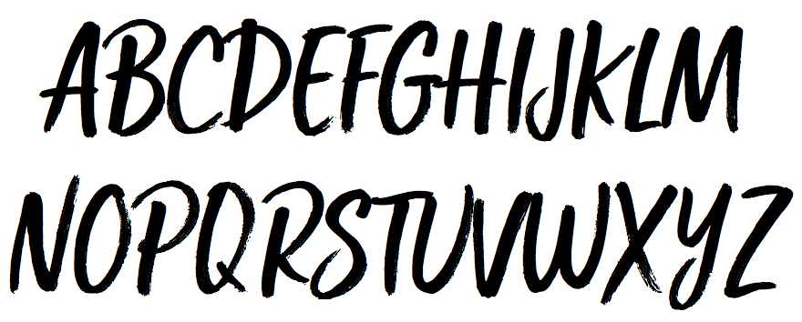

# Font Metrics

Have you ever battled a pesky font that wouldn't render the same way across operating systems no matter what CSS value you put for its line-height? If you answered yes to any of the previous question, then this is the mind-numbing article for you!

Getting to the root of a font issue can be tedious, but, buried under a thick level of boring, there is a solution that's actually pretty interesting.

It all starts with a font called Custom Fresh...

* * *

- [Custom Fresh<small>™</small>](#custom-freshsupsmall%E2%84%A2smallsup)
- [Varying vertical-heights](#varying-vertical-heights)
  - [Current metadata](#current-metadata)
  - [Recalculated metadata](#recalculated-metadata)
- [Demo](#demo)
- [Updating a font](#updating-a-font)
- [Fixing it old school](#fixing-it-old-school)

* * *

## Custom Fresh<small>™</small>

    

*Custom Fresh was created in 2016 and is a registered trademark of [BLKBK Type](https://blkbktyp.com/). Use of Custom Fresh in this document is for demonstration purposes only and is not available publicly.*

## Varying vertical-heights

The explanation for a font's calculated vertical-height is grueling and mostly skippable. I want to give you the important highlights and leave out the convoluted stuff, but if you're interested, please read [this 3-part, in-depth series from Webfonts.info](http://webfonts.info/articles/Part-1-We-need-to-talk-about-line-height).

**Microsoft Windows and Mac OSX use different metadata when determining the line-height of a font**, that's the one take-away you need. The responsibility of this calculation is on the operating system (98% of the time, sometimes the browser chips in), which is why inconsistencies from Mac to PC are often consistent between Chrome, Firefox, and Internet Explorer.

### Current metadata

There are three dimensions defined in a font's metadata that an operating system can use to determine vertical-height: **Ascender, Descender,** and **Line Gap**. The tricky part is that OSX uses all three while Windows only uses **Ascender** and **Descender**.

The values for these properties were set as

|             |  OSX | Windows |
|:------------|-----:|--------:|
| *Ascender*  |  840 |    1000 |
| *Descender* | -400 |       0 |
| *Line Gap*  |    9 |     n/a |

Here's a visual comparison of those metrics with shades of blue representing each property:

| OSX | Windows |
|:--|--:|
|  |  |

### Recalculated metadata

The method for aligning these metrics to yield a more consistent view is to split the Line Gap value between the WinAscent and WinDescent values. The idea is that the leveled-out dimensions will allow each operating system's vertical-height calculation methods to visually center text in the same way.

Recalculating these values to be optimized for web viewing, they become:

| | OSX | Windows |
|:--|--:|--:|
| *Ascender*  | 1002 |     975 |
| *Descender* | -371 |    -225 |
| *Line Gap*  |   24 |     n/a |

| OSX | Windows |
|:--|--:|
|  |  |

## Demo

[Here's a live example of both font versions.](https://rodenbeek.com/custom-fresh-test)

This demo shows that with an optimized version of Custom Fresh, the vertical-height calculated by each operating system winds up being the same. Here are in-browser screenshots from both environments:

| | OSX | Windows |
|:--|--:|--:|
| *Original*  |   |   |
| *Converted* |  |  |

The original Custom Fresh renders in offset positions between OSX and Windows, but with the vertical-height metrics recalculated, each operating system renders identically.

## Updating a font

Having a web-optimized version of any font allows the use of plain text in HTML instead of relying on images to show a consistent view across operating systems. Plain text HTML facilitates

* **Search Engine Optimization** and screen-reader **Accessibility**
* Faster page load
* Authorability and/or faster development time
* Sharp, readable text on page zoom

Creating a full-fledged version of the recalculated Custom Fresh required [Fontlab Studio](https://www.fontlab.com/font-editor/fontlab-studio/) and some time allowed for testing. I recommend giving your font two or three days of sprint time for a safe conversion.

The copyright metadata on fonts can be thorough, and most creators will have preferences for how they gets modified. Don't change anything about a font without consulting its creator or distributor first.

## Fixing it old school

The further we move from older media, the looser we've become with cross operating system awareness. Most new fonts have this exact same problem, but at smaller font sizes, the discrepencies are harder to identify. If you're experiencing a similar issue, there is licensed software to help fix it.
