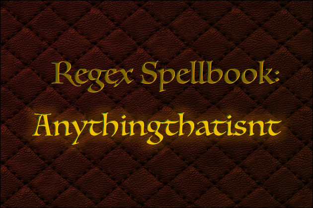
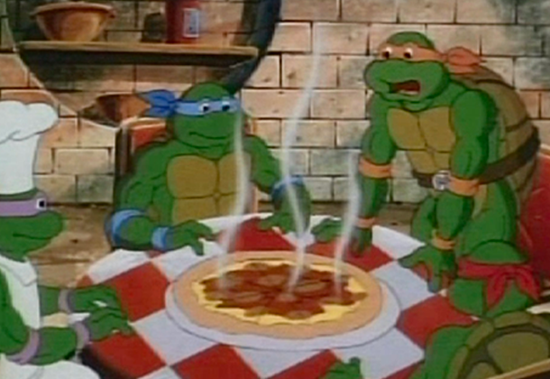
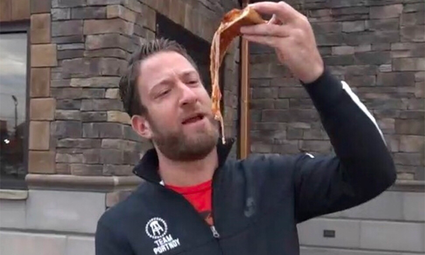

# Regex Spellbook: Anythingthatisnt

Regular Expressions can be an intimidating venture, but the right spells can help you write coherently, for both yourself and other developers.

The following spell helps me mentally speak what I'm typing it out, "Anything that isn't..."

```JavaScript
new Regex(/(?:(?!word).)+/);
```

Using a negative match is a common use for a regex, and thinking about it as "Anything that isn't..." will help you remember how to do it correctly each time.

* * **

<!-- MarkdownTOC -->

- [Broccoli &amp; Pizza](#broccoli-amp-pizza)
- [How do we fix it?](#how-do-we-fix-it)
- [Anything That Isn't...](#anything-that-isnt)
- [Conclusion](#conclusion)

<!-- /MarkdownTOC -->

* * **

## Broccoli & Pizza

```JavaScript
var str = 'Broccoli is gross. Pizza is gross.';
```

For the following examples we'll use that two-sentence string.

Our job is to fix this sentence because pizza isn't "gross" at all. It's "super delicious" and that string should say so.



## How do we fix it?

Unfortunately we can't just replace "gross" with "super delicious":

```JavaScript
str.replace(/gross/, 'super delicious');

// 'Broccoli is super delicious. Pizza is gross.'
```

In this form, we replaced replaced the wrong "gross". Okay, let's try the `g` modifier to make the replacement happen for all matches:

```JavaScript
str.replace(/gross/g, 'super delicious');

// 'Broccoli is super delicious. Pizza is super delicious.'
```

That fixed the pizza's adjectives but now we've got the reverse issue with the fox. Okay, let's just run a second regex to fix that:

```JavaScript
str.replace(/gross/g, 'super delicious');
str.replace(/super delicious/, 'gross');

// 'Broccoli is gross. Pizza is super delicious.'
```

That worked, but it's super hacky. We just ran a non-global match to replace the first "super delicious" because we knew that one was bad. Maybe a better solution would be to lean on JavaScript a little more, split the string then manipulate its parts separately then join them again.

And that would work too, but each time you're looking at a solution that is tailor fit for just the one example. What if the string was structured differently:

```JavaScript
var str = 'Brocolli is gross. Onions are gross. Pizza is gross.';
```

Parsing a two-sentence string breaks when there's three sentences or if the sentences are out of order. So how do we fix this?

## Anything That Isn't...

In regular expressions, there is a handy utility used to ignore single characters. Just like `/[P]/` will identify a capital-P, `/[^P]/` identifies any single thing that is not a capital-P.

Such a thing would be very helpful if it detected more than a single character. In order to harness this power in long form we need to invoke "Anythingthatisnt..." (it really does help to say that phrase as you type it).

`(?:(?!Pizza).)+`

Let's step through this from the outside in.

Surrounding everything is a non-capture group `(?:.)+`. It's job is to clump together all of the period-selections. See that `.` period means "anything at all" to regex, and the `+` plus-sign means do it over and over again.

Most importantly, right before that period is a negative look-ahead, `(?!Pizza)` which makes sure that period selection isn't "Pizza".

As soon as this expression comes up to "Pizza", it stops dead in its tracks. From there we just capture the remaining phrase and insert "super delicious".



We'll wrap that all in a capture group since we need to put the matches back into the string, but that's not important to the pattern. All together it looks like:

```JavaScript
str.replace(/((?:(?!Pizza).)+)(Pizza is )gross/, '$1$2super delicious');
```

It really does help to say it to yourself, outloud even, if that's what floats your boat.

```JavaScript
// (?:
// anything

// (?:(?!
// that isn't

// (?:(?!Pizza
// "Pizza"
```

## Conclusion

It definitely takes some practice. It took plenty of time and aggrevated mentors to pound this pattern into my head, but it's consistently the most important spell in the book when I'm reaching for a regular expression.

I hope this will help you as much as it's helped me. Thank you for reading!

* * *

> p.s. No offense, Broccoli. I still love you.
>
> p.p.s If you love pizza, check out Dave Portnoy https://www.barstoolsports.com/bio/54/el-presidente
