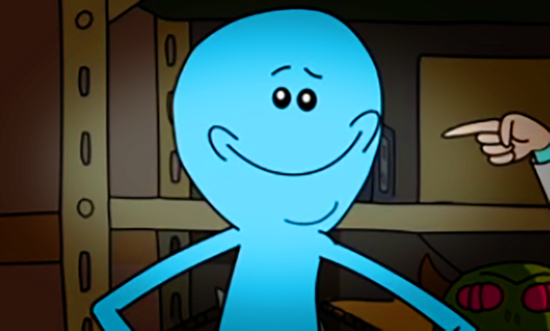
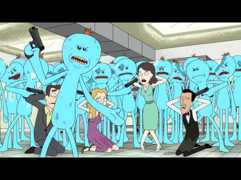
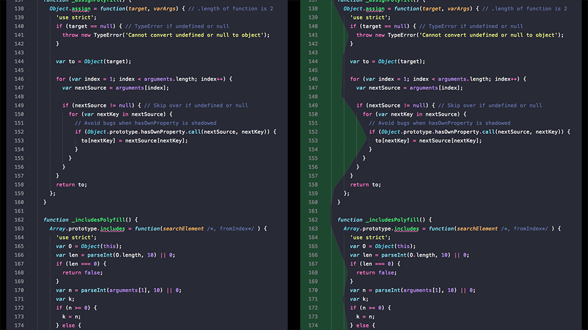
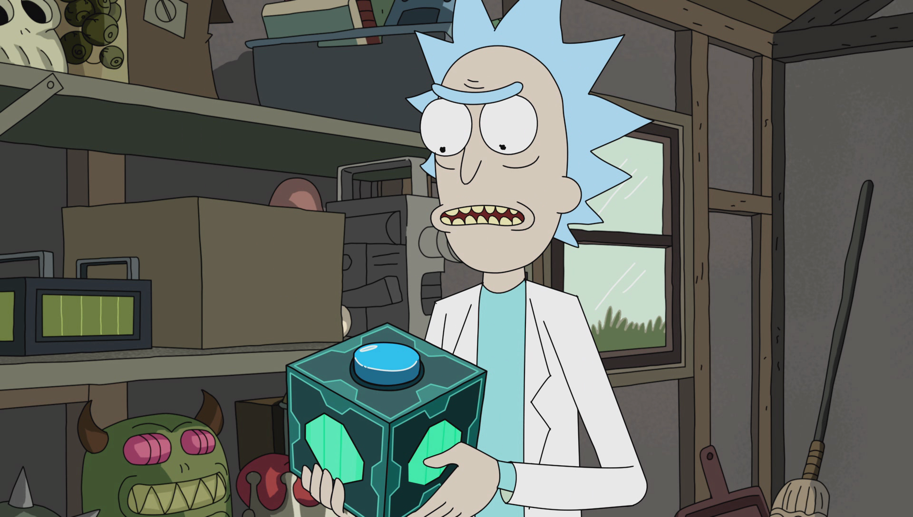
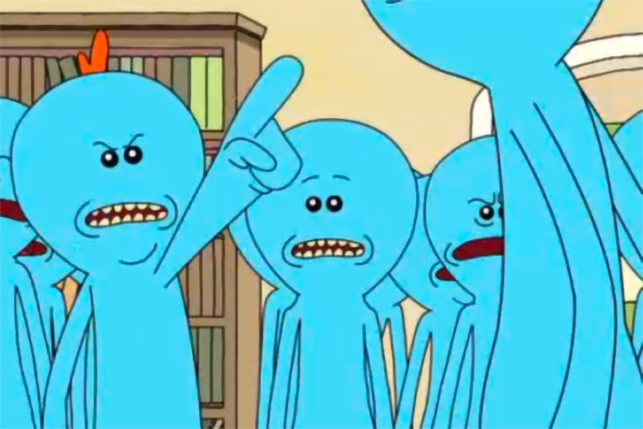
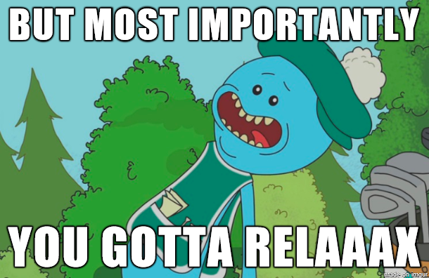

# What Mr. Meeseeks Can Teach Us About Single Responsibility

If Rick and Morty has taught me anything, it's how to write code. Just kidding, Rick and Morty has taught me everything. For now though, let's focus on one of the show's characters and how his brief existence is the perfect analogy for the **Single Responsibility Principle**.

* * **

- [What the hockey sticks is a Mr. Meeseeks](#what-the-hockey-sticks-is-a-mr-meeseeks)
- [WTF is the Single Responsibility Principle](#wtf-is-the-single-responsibility-principle)
- [Red Flags of Not-single Responsibility Code](#red-flags-of-not-single-responsibility-code)
  - [Arrow code](#arrow-code)
  - [Comments](#comments)
  - [Duplicate code](#duplicate-code)
  - [Large files](#large-files)
- [Solutions](#solutions)
  - [Named functions (adding Meeseeks)](#named-functions-adding-meeseeks)
  - [Generic functions (reusing Meeseeks)](#generic-functions-reusing-meeseeks)
  - [Guard clauses (killing Meeseeks)](#guard-clauses-killing-meeseeks)
- [Post-mortem](#post-mortem)
- [Addendum](#addendum)

* * **

## What the hockey sticks is a Mr. Meeseeks

[Mr. Meeseeks](https://www.youtube.com/watch?v=KtNRU73CFzg) is an apparition, summoned from a thin air with the push of a button, who exists for as long as it takes him to fulfill a given request. The main goal of a Meeseeks is to complete his task as quickly as possible so he can go back to not existing.

> "Existence is pain to a Meeseeks, Jerry, and we will do anything to alleviate that pain!"

## WTF is the Single Responsibility Principle

The **Single Responsibility Principle** is a way to enforce smaller, more focused sections in your code. Think of each function as a Meeseeks. Each of these separate concerns has one purpose, and it wants to take the fastest path to fulfill it so it can disappear.

In the Rick and Morty episode "Meeseeks and Destroy", there are two Meeseeks examples that illustrate how simple-seeming requests can be complex and vice-versa. They are given in quick succession by two characters:

> *Beth spawns a Meeseeks*
> Beth: I want to be a more complete woman!
> 
> Jerry: You guys are doing it wrong. He said "*simple*".
> 
> *Jerry spawns a Meeseeks*
> 
> Jerry: I would like to take two strokes off my golf game.

It turns out becoming a complete woman only requires a sincere pep talk. Conversely, taking two strokes off a golf game turns into a slog of conditional, synchronous methods that get muddled up when contained in just one Meeseeks.

> Jerry: Okay, well, which is it? Square my shoulders or keep my head down?
> 
> Meeseeks: Well, it's both. But most importantly, you got to relax.

Just right away, it's easy to picture this as a piece of example code\* that is convenient to the points I want to make:

    if (jerry.status === 'tense') {
        jerry.status = 'relax';
    }

    /**
     * need to be sure that Jerry's head is down and
     * both of his shoulders are squared
     */
    if (jerry.head.status === 'up') {
        jerry.head.status = 'down';
    }

    jerry.shoulders.forEach((shoulder) => {
        if (shoulder.status === 'slumped') {
            shoulder.status = 'squared';
        }
    });

    jerry.swing(function () {
        if (!jerry.followThrough) {
            console.error('Aw, c'mon, Jerry.');
        }
    });

Let's go over some tell-tale signs that our Meeseeks' purpose is too complex, and review some ways we can separate its concerns among multiple Meeseeks.

<small>\*Example code is meant to parody real life code. Hopefully its impracticality is less distracting than its novelty is engaging.</small>

## Red Flags of Not-single Responsibility Code

I'm using JavaScript for my example code, but please note that the Single Responsibility principle, like Mr. Meeseeks himself, can improve every single aspect of your life. Yes, even basketball*.

<small>*Probably not basketball though.</small>

### Arrow code

If you zoom out in your script file, you'll see the code we create has patterns. This view looks like a sideways mountain range that peaks and valleys along the way.

Ideally our code is more foot-hills than mountains, with its functionality close to the horizon line. However, from this birds eye view, we can see that loops nested in conditions nested in anonymous functions can create an arrow-shaped Mt. Everest that is difficult for even seasoned mountaineers to scale.

### Comments

Another symptom of overly complex code is overly complex comments.

I don't mean the helpful, we-did-this-bit-of-code-for-this-reason kind of comment. I'm talking about the novella comment blocks that cannot be removed without making the related code indecipherable.

### Duplicate code

If you're noticing the same line or lines of code cropping up, you've noticed a symptom of unnecessary code. It may have felt like a good thing because the tedious task of typing blocks of functionality turned into a simple copy/paste routine, but this is actually a bad thing.

This sentiment is illustrated in the Meeseeks episode when, discouraged that he can't improve Jerry's golf game quickly, the original Mr. Meeseeks begins spawning more Mr. Meeseeks and gives them his same directive. The result is a dozen Meeseeks speaking over each other, each making the situation harder to understand.

### Large files

A high line count in a single file can be symptomatic in some code, but completely acceptable in others. Obviously, this is a thing to avoid, but some scripts just require lots of code. If as many of the concerns have been separated as possible, it's probably okay.

Use file size as a red flag, but be aware that it could be a red herring.

## Solutions

As previously stated, the ideal topography for a block of code is level. We want a function to tell a story with as short and few chapters possible. Let's go over the Meeseeks' solution for improving Jerry's golf game and see if we can cure some of these symptoms.

### Named functions (adding Meeseeks)

Anonymous functions are be the easiest piece of code to clean up, and, in my opinion, the most satisfying. I recommend placing a named function below and hoisting the call up to the more primary code where it's used. Your stack traces will be much easier to read when you're debugging, just to name one of many benefits.

Let's see how our example looks if, instead of one Meeseeks handling all this logic, we push the button a couple of times and spawn two more Meeseeks, each receiving a singular purpose.

    ...

    jerry.shoulders.forEach(assignShoulderStatus);

    jerry.swing(checkFollowThrough);

    function assignShoulderStatus(element) {
        if (element.status === 'slumped') {
            element.status = 'squared';
        }
    }

    function checkFollowThrough() {
        if (!jerry.followThrough) {
            console.error('Aw, c'mon, Jerry.');
        }
    }

Our main Meeseeks is condensed to two lines. Each line communicates its action in sentence form, while indicating which Meeseeks its delegating a fuller concern to.

### Generic functions (reusing Meeseeks)

When we created the named function `assignShoulderStatus`, we gave ourselves a global method that could alleviate duplicate code elsewhere. If we tweak our named function, make it a little more generic, we could accommodate all of our status updates, effectively passing all that functionality to the Meeseeks that exists to handle it:

    assignStatus(jerry, 'tense', 'relax');

    assignStatus(jerry.head, 'up', 'down');

    jerry.shoulders.forEach((shoulder) => {
        assignStatus(shoulder, 'slumped', 'squared')
    });

    jerry.swing(checkFollowThrough);

    function assignStatus(element, badStatus, goodStatus) {
        if (element.status === badStatus) {
            element.status = goodStatus;
        }
    }

Now it's easy to see what our main Meeseeks is concerned with. His single responsibility is ticking off all the statuses before telling Jerry to go ahead and swing his club.

### Guard clauses (killing Meeseeks)

While a guard clause is an easy win for levelling out arrow code, it's also an effective way to communicate what conditions are unacceptable for your function's single concern.

Remember, a Meeseeks hates existing. It wants to fulfill its purpose so it can go away as quickly as possible. If it doesn't have to do anything, it's better to let it die. Let's put a guard clause in the `assignStatus` function:

    function assignStatus(element, badStatus, goodStatus) {
        if (element.status !== badStatus) {
            return;
        }

        element.status = goodStatus;
    }

The astute reader will notice we've actually lengthened our function, but the wizened, probably more attractive reader will have noticed how much easier this is to read.

The only concern for the `assignStatus` Meeseeks is to put a value into a property. If he can die right away, he would prefer to do that. If he can't die right away, then what he needs to do is written on his baseline. Without the extra indentation, it’s visually represented as his fundamental task.

## Post-mortem

With all of those solutions in place, each separate Meeseeks and the simple purpose they fulfill are clear. Now we can simply spawn a Meeseeks, tell it to `improveGolfGame()`, and pass it an instance of `Jerry`.

    /** Main Meeseeks */

    function improveGolfGame(golfer) {
        assignStatus(golfer, 'relax');

        assignStatus(golfer.head, 'down');

        golfer.shoulders.forEach((shoulder) => {
            assignStatus(shoulder, 'squared')
        });

        golfer.swing(checkFollowThrough.bind(this, golfer));
    }

    /** Helper Meeseeks */

    function assignStatus(element, status) {
        if (element.status === status) {
            return;
        }
        
        element.status = status;
    }

    function checkFollowThrough(golfer) {
        if (golfer.followThrough) {
            return;
        }
        
        console.error(`Aw c'mon, ${golfer.name}`);
    }

The quality of life for a Meeseeks is directly tied to his ability to focus on and quickly complete a simple task. If there's a better analogy for clean code, I'm not interested in hearing it.

Thanks for reading!

* * *

## Addendum

**"that `assignStatus` function with the field names being passed in as strings just.....ugh"**

The code here is meant to mime scenarios from a really weird cartoon. It is garbage parading as pseudo code. Please don't use this to illustrate some point about the state of front-end these days, and definitely don't ever copy/pasta any part of any of this into your own programs.

