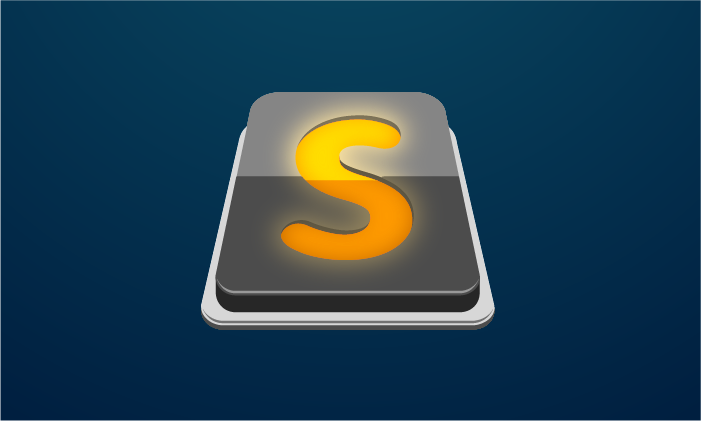
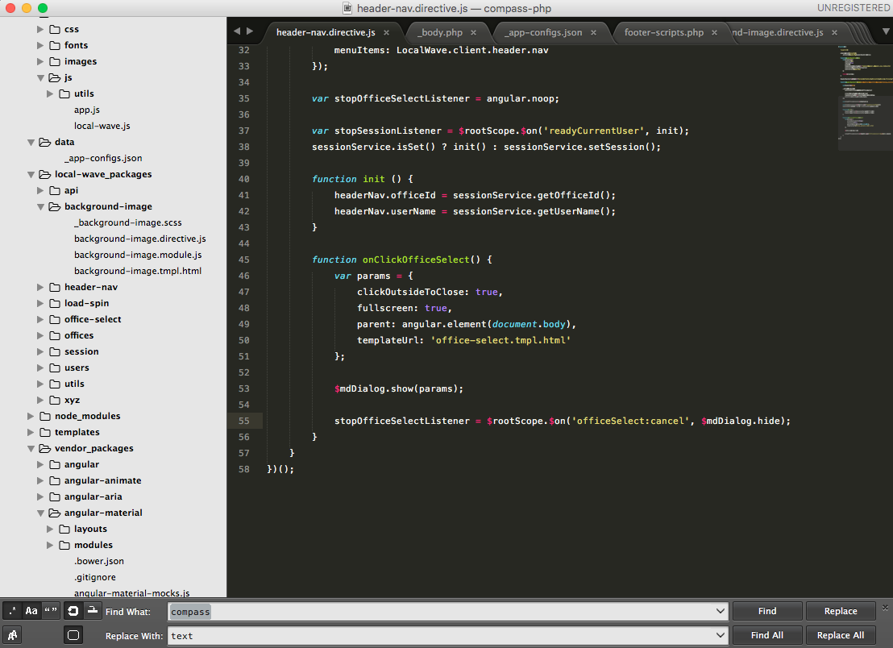
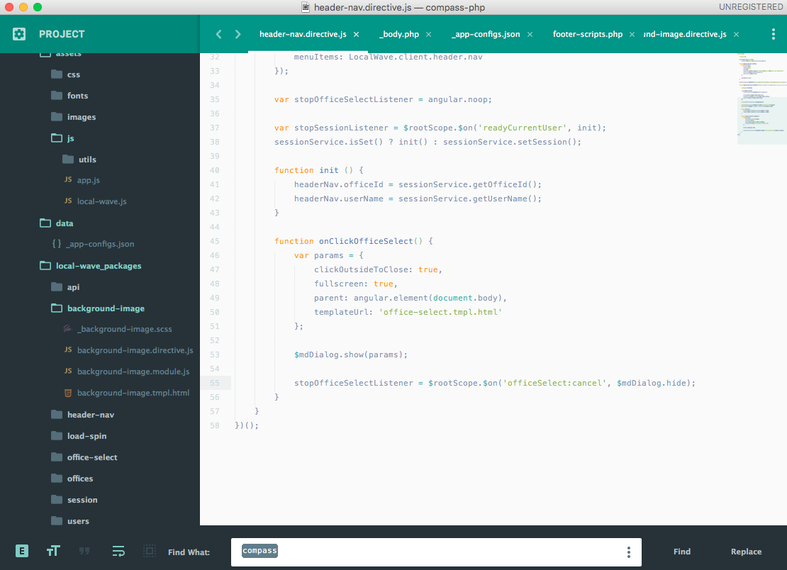

# Sublime Text: A quick-start overview for beginners

Like other developer tools, choosing a text editor can feel tricky and it’s going to take some experimenting to find the one that’s right for you. Ultimately though, no matter your choice, most perform the same basic tasks needed to develop in any language.

The two biggest factors at play in choosing a text editor should be personal comfort followed closely by team preference. There is some wiggle room, for instance Atom, WebStorm, and Sublime are going to offer very similar user experiences, but you wouldn’t want to be the only person on a team rocking Notepad. Huge differences in personal tools are just unnecessary white noise during paired or shared programming.

I'm giving an overview of [Sublime Text](https://www.sublimetext.com/3) because it’s my favorite, but I strongly recommend trying a few editors to find one that’s a good fit for you. This article can also serve as a quick-start guide for those times when you need to setup an environment and need a list of packages to start with.

* * *

- [Overview](#overview)
- [Packages](#packages)
  - [Basic Packages](#basic-packages)
  - [Themes and Color Schemes](#themes-and-color-schemes)
  - [Advanced Packages](#advanced-packages)
- [Epilogue](#epilogue)

* * *

## Overview

Out of the box, Sublime Text offers everything you’ll need to be a developer. There is a suite of built-in functionality including a language compiler, a project/workspace builder, and methods for highlighting/editing multiple areas of a document at once, but this overview won’t be going that deep. You can download and read more about Sublime Text here.

By default there’s a left-hand sidebar that gives an overview of your Project’s folder structure, the text edit pane, a right-hand mini-map of the current document, and the Find/Replace panel at the bottom.

To really get started with Sublime, we need to look at its package system. Below I’ll go over the basic packages you’ll need and then some more advanced ones that I would have a hard time living without.

## Packages

Sublime packages are installable modules that other people have built to enhance Sublime’s functionality. If there’s something you want Sublime to do, odds are good that someone’s built a package to do it.

> I recommend doing a Google search for a package before blindly installing one. Some packages can be buggier than others, and there’s often more than one option available. It’s best to know exactly what you want when you go to install.

To install a package, you can download it from a browser and then copy it into Sublime’s package folder. This is tedious and not fun but luckily you only have to do it once. The first package you install should be [Package Control](https://packagecontrol.io/installation). Once you have this package, installing others is a breeze.

If you haven’t already, go install Package Control and then read [Package Control‘s usage guide](https://packagecontrol.io/docs/usage). I’ll wait.

### Basic Packages

Now that we have a fast and intuitive way to install packages, let’s add the basic packages. These are the packages that are so utilitarian and foundational that I often forget they’re added on.

**[Emmet](http://www.hongkiat.com/blog/html-css-faster-emmet/)** Auto-complete for HTML and CSS that also allows time-saving short-hand. Get too good with it and you might be seduced into Jade/Pug development

**[DocBlockr Auto-complete](https://packagecontrol.io/packages/DocBlockr)** for a variety of commenting styles, but most importantly it formats comments to be compliant with most Doc builders. Very handy for effortless JSDocs and even ngDocs!
Color Highlighter Mostly useful for CSS-heavy development, but I’m always glad to see it in the rare cases I’ve defined a color in another language.

**[Color Highlighter](https://packagecontrol.io/packages/Color%20Highlighter)** Mostly useful for CSS-heavy development, but I’m always glad to see it in the rare cases I’ve defined a color in another language.

**[Console Wrap](https://packagecontrol.io/packages/Console%20Wrap)** If you’re writing a lot of JavaScript, you’re going to be writing a lot of console logs. Take this.

**[Sidebar Enhancements](https://packagecontrol.io/packages/SideBarEnhancements)** As useful as the default sidebar is, it gets infinitely better. This package puts a suite of intuitive methods inside of a right-click menu, so you can create/rename items, reveal them in Finder, or even open files in a browser.

> **[Git](https://packagecontrol.io/packages/Git)** There is a Git package that allows you to manage version control from Sublime, but I recommend sticking with command-line actions or using an official GUI from your Git provider. A third-party package through a text editor just feels like a hazardous gamble to me. That said, the Git package is incredibly useful and, if you’re okay with it, you should totally use it.

### Themes and Color Schemes

Okay, got the boring stuff out of the way, take a break and try out some Themes and Color Schemes!

**Themes** will alter the overall appearance of Sublime. This includes text and background colors as well as spacing of all the interface’s elements.

**Color Schemes** will alter the syntax highlighting and background color of just the editing pane.

I’m a huge fan of Ken Wheeler's [Brogrammer Theme](https://packagecontrol.io/packages/Theme%20-%20Brogrammer). The light-on-dark layout is great for visibility no matter the screen’s brightness, and (this is probably the most important feature themes get wrong) the find/replace bar has generous padding/spacing.

A little while ago I switched to [Material Theme](https://packagecontrol.io/packages/Material%20Theme) and I’ve finally been converted away from Brogrammer. The integration of Google Design’s layout concepts and sidebar icons is beautiful. The whole aesthetic is comfortable and easy to use. Protip: after setting Material Theme as your theme, set Material-Theme-Lighter as your color scheme. This is of course an IMO, but IMO, it’s the only way to go.

### Advanced Packages

There is no end to language-specific packages to enhance your experience. These are just a few examples that I recommend using, but please note that there are more and so should you!

* **[Markdown Preview](https://packagecontrol.io/packages/Markdown%20Preview)**
* **[MarkdownTOC](https://packagecontrol.io/packages/MarkdownTOC)**
* **[HTML5](https://packagecontrol.io/packages/HTML5)**
* **[SCSS](https://packagecontrol.io/packages/SCSS)**
* **[JSFormat](https://packagecontrol.io/packages/JsFormat)** (works for JSON too!)
* **[JavaScript Next](https://packagecontrol.io/packages/JavaScriptNext%20-%20ES6%20Syntax)**
* **[SVGO](https://packagecontrol.io/packages/SVGO)**

## Epilogue

Really the best advice anyone can give on the topic boils down to their personal preference and opinion. Using a recommended text editor isn’t very useful if you’re not comfortable with it, so go find the one that is right for you. If you decide Sublime is that one, I hope you found something useful here!